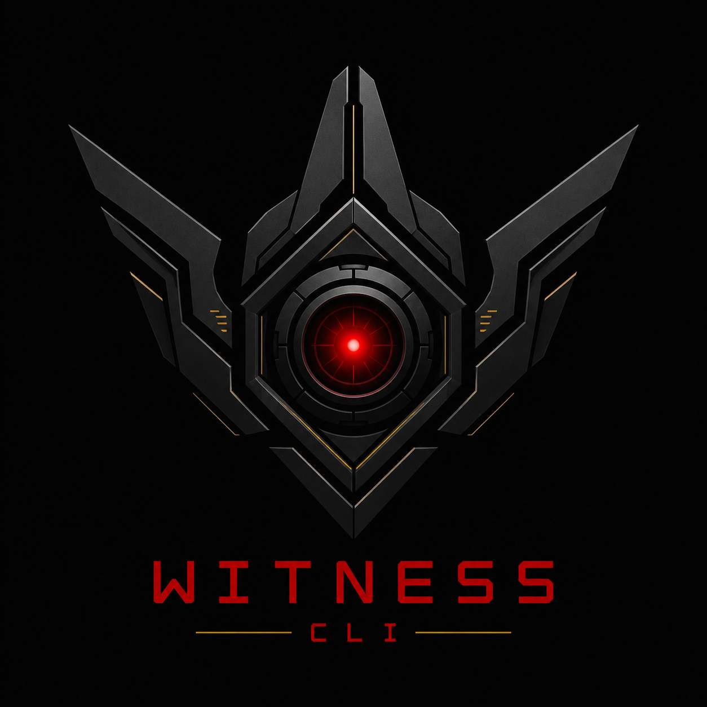

<p align="center">
  
</p>

<h1 align="center">Skuld CLI</h1>
<h3 align="center">the future’s watcher for your fleet</h3>

---

## Quick Start

- Build: `task build`
- Validate: `task validate`
- Local reconcile harness: `task local:run`

## Prepare AGE Key

```bash
AGE_KEY_FILE="/path/to/key.age"
age-keygen -o "${AGE_KEY_FILE}"

# if you use 1password push the entry to save it
op item create --category="API_Credential" --title "API Credentials ($(date +%d/%m/%Y))" "[file]=${AGE_KEY_FILE}"
```

## Local Harness

The local harness is Docker Compose-based and scoped to the runtime reconcile command.

It uses:

- `docker compose` as the only orchestrator
- a dedicated harness image from `docker/local-harness/Dockerfile`
- a host-built `skuld-cli` binary mounted read-only into the container
- a writable runtime root for reconcile output and cloned repo state
- the prepared manifest and age key mounted read-only
- a seeded source repo mounted read-only

Run it with:

```bash
task local:prepare
task local:run
```

This reduced harness does **not** attempt to simulate SSH, sudo, systemd, or full target-host bootstrap.

See `docs/local-harness.md` for exact scope and mounted paths.

## Manual Secret Inspection

```bash
export manifest="my-manifest.yaml"
export ageKeyFile="my-key.age"

yq -r '.spec.secrets.SECRET_NAME' "${manifest}" | base64 -d | age -d -i "${ageKeyFile}" | tee secret.enc

nano secret.enc
```
